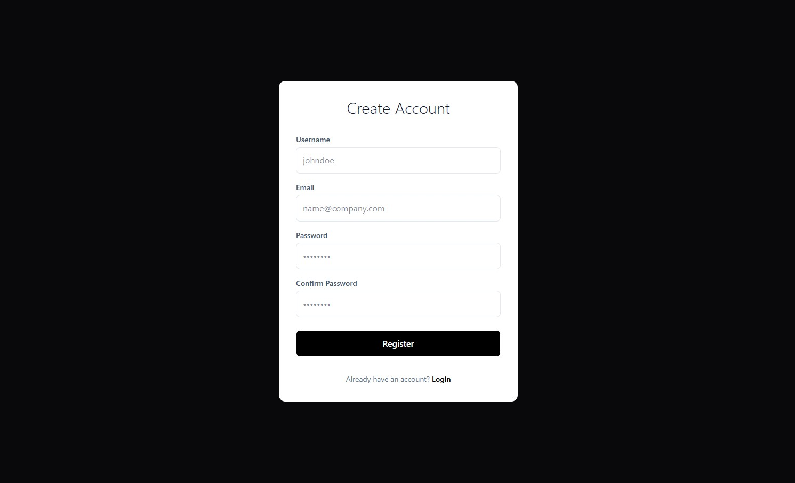
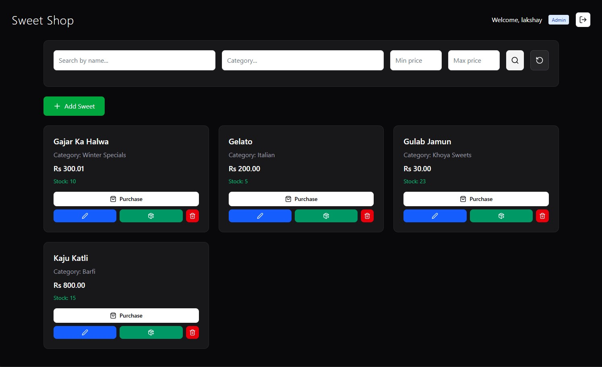

# Sweet Shop Management System
A comprehensive, full-stack web application designed to streamline operations for sweet shops. This system manages inventory, processes sales, and tracks customer interactions, providing a modern solution for traditional businesses.
Key features include:
*   **Inventory Management**: Track stock levels of various sweets and raw materials.
*   **Sales Processing**: Efficient order (stock) management.
*   **Authentication**: Secure login for staff and admins.

The application is built using a **Django** backend for robust data handling and API services, coupled with a **React (Vite)** frontend for a dynamic and responsive user interface.

## Tech Stack

*   **Backend**: Python, Django, Django REST Framework
*   **Frontend**: React, Vite
*   **Database**: PostgreSQL

## Setup & Installation

Follow these steps to set up the project locally.

### Prerequisites
*   Node.js (v16+)
*   Python (v3.8+)

### 1. Clone the Repository
```bash
git clone https://github.com/LakshaySharma10/Sweet-Shop-Management-System.git
cd Sweet-Shop-Management-System
```

### 2. Backend Setup
Navigate to the backend directory and set up the Python environment.

```bash
cd backend

# Start the services using Docker Compose
docker compose -f docker/dev.docker-compose.yml up --build
```
The backend API will be available at `http://localhost:8000`.

### 3. Frontend Setup
Open a new terminal, navigate to the frontend directory, and install dependencies.

```bash
cd frontend

# Install dependencies
npm install

# Start the development server
npm run dev
```
The frontend application will run at `http://localhost:5173`.

## Screenshots

### Login Screen


### Register Screen


### Admin Dashboard


### General User Dashboard


## My AI Usage

### Which AI tools I used
*   **GitHub Copilot**
*   **ChatGPT** 


### How I used them
*   **Planning**: Used AI to break the development plan into several modules so that consistent output was maintained.
*   **Deployment**: I used ChatGPT to write the necessary configuration files (Dockerfile, `entrypoint.sh`, `render.yaml`).
*   **Debugging**: Used AI to troubleshoot specific errors, such as Docker build failures and static file handling in Django.

### Reflection on how AI impacted my workflow
*   **Speed & Efficiency**: AI dramatically reduced the time spent on configuration and boilerplate code, allowing me to focus on core logic.
*   **Problem Solving**: AI helped to provide alternatives to a problem helping to choose the best out of total available ones.  